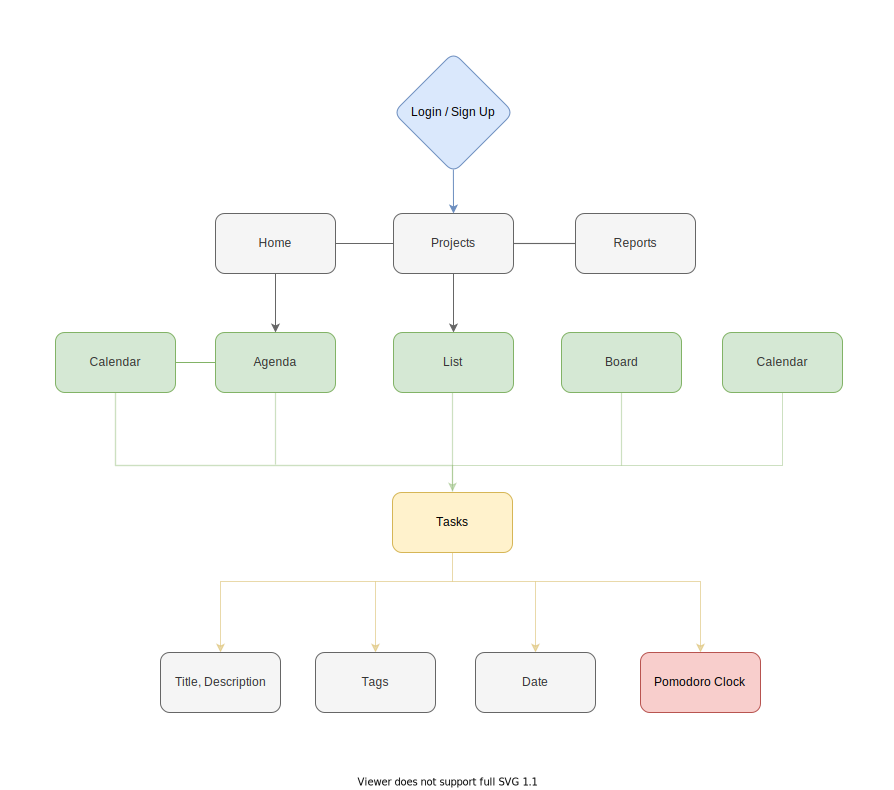

  

 

  

    <a href="https://github.com/Joy-port/joyup# About-JoyUp">About</a>
    |
    <a href="https://github.com/Joy-port/joyup# Demo">Demo</a>
    |
    <a href="https://github.com/Joy-port/joyup#Contact">Contact</a>
  

# JoyUp
[JoyUp](https://joyup-management.web.app) is a task and project management tool combined with Pomodoro Timer, which helps users to manage time effectively and increase their productivity.

## About JoyUp
- Implemented customizable and extendable **slash commands** with config in self-build text editor.
- Built self-calculated component for countdown **pomodoro clock** animation. 
- Created calendar with `react-big-calendar` and DnD board with `react-beatiful-dnd`, making task management more efficient. 
- Applied `Firebase Firestore` as database, and `Firebase Hosting` with deployment of react app.

## Built with

     

**Base**
- React app
- Redux
- Firebase
- Tailwind
- ESLint

**Libraries**
- react-beautiful-dnd
- react-big-calendar
- react-datepicker
- react-joyride

### Flow chart
 

<!-- ### Demo -->
<!-- ### Future Features -->
### Contact
  
  